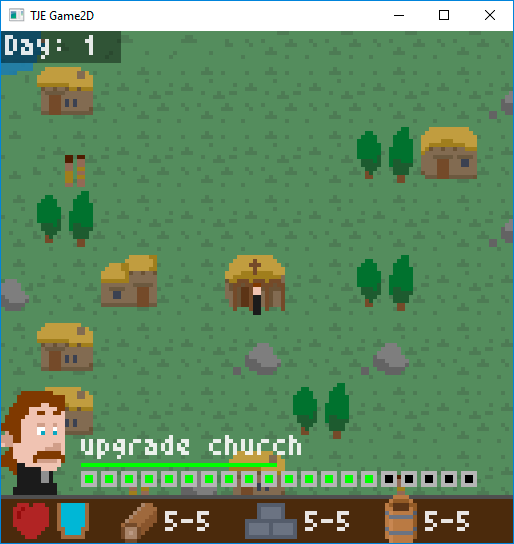

# Game2D 2019

**The Converters** is a 2D game I did during a week for my Gamedev Course at Universitat Pompeu Fabra. The theme was FAMILY+RELIGION.

Its a turn based game with a resolution of 128x128 pixels, and it can be played with cursors + A + Z.

The whole game is coded in c++ using a simple 2D framework, and the game logic is less than 1000 lines of code.

All the graphics are stored in a single image.

This is published as an educational example for students.
